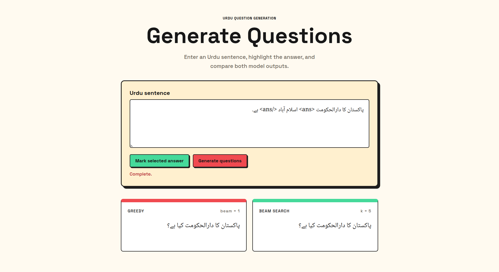

# Urdu Question Generation

A demo for generating Urdu questions from sentences with marked answers.



## Project Structure

```text
urdu-question-generation/
├── app/
│   ├── main.py          # FastAPI application and API routes
│   ├── model.py         # Seq2Seq model with attention
│   ├── tokenizer.py     # SentencePiece tokenizer wrapper
│   ├── inference.py     # Greedy and beam-search inference
│   └── schemas.py       # API request and response schemas
├── scripts/
│   ├── prepare_data.py  # Prepare training and validation data
│   ├── train_tokenizer.py # Train the SentencePiece tokenizer
│   ├── train.py         # Train the question generation model
│   └── evaluation.py    # Evaluate model outputs
├── data/                # Prepared datasets
├── artifacts/           # Tokenizer files and model checkpoints
├── results/             # Metrics, samples, and figures
├── frontend/            # HTML, CSS, and JavaScript demo interface
├── config.py            # Project and model configuration
├── requirements.txt     # Python dependencies
└── README.md            # Project documentation
```

## Setup

```bash
python3 -m venv .venv
source .venv/bin/activate
pip install -r requirements.txt
```

## Prepare and Train

Run these commands in order:

```bash
python3 -m scripts.prepare_data
python3 -m scripts.train_tokenizer
python3 -m scripts.train
python3 -m scripts.evaluation
```

## Run the App

```bash
uvicorn app.main:app --reload
```

Open `http://127.0.0.1:8000` in your browser.

:)